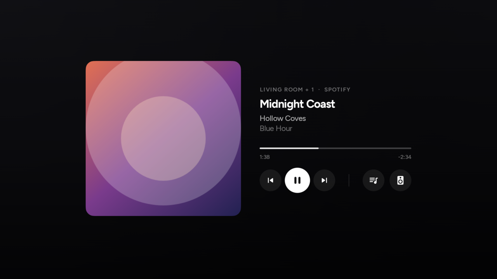
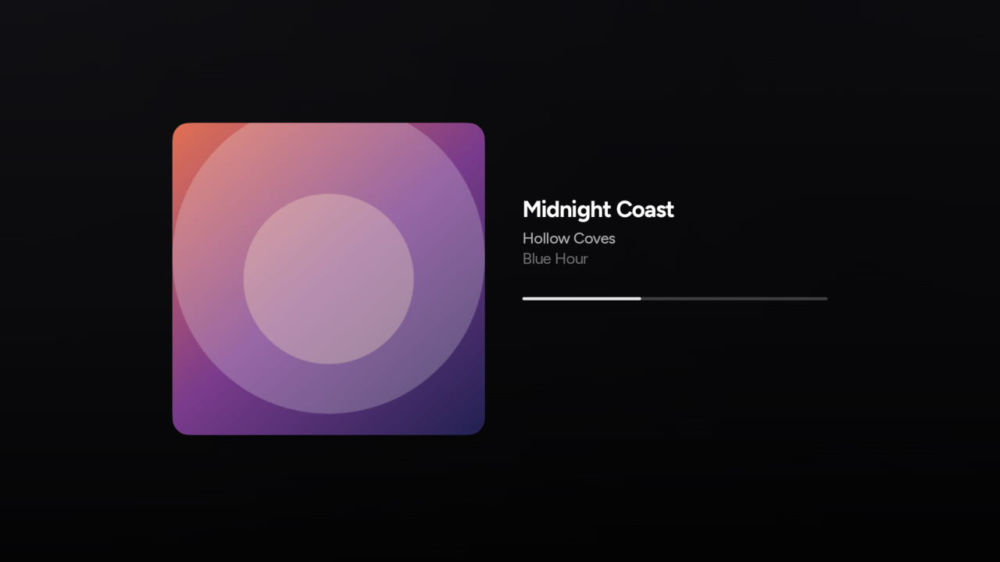
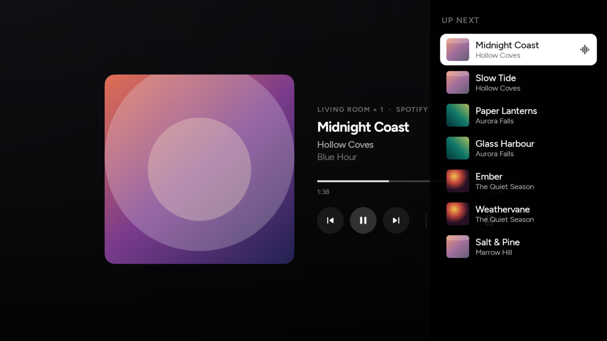
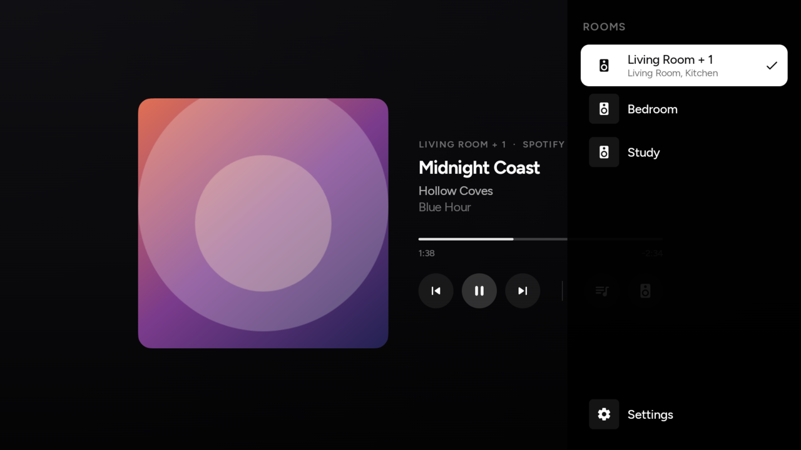

# Sonos Now Playing on TV

A full-screen now-playing screen for **Android TV** and **Google TV**. Put on a record, sit on the sofa, and the album art fills the television.

It finds your Sonos speakers on your home Wi-Fi. You do not need a Sonos account, and this is not an official Sonos app.

**Version 1.2**

  

## What you get

- Big artwork, song title, artist, album, and which room is playing
- Play, pause, skip, and volume from the TV remote (volume changes the **speakers**, not the TV)
- A queue list and a room picker
- After a few seconds of sitting still, the buttons fade so the cover art can breathe
- An optional **screensaver** that shows the same screen while music is playing
- Other TV apps (for example a custom home screen) can show what is playing too

  

This will not work on a phone. You need a TV that runs Android TV or Google TV (Chromecast with Google TV, many Sony / TCL / Hisense sets, NVIDIA Shield, and similar).

Your TV and your Sonos speakers must be on the **same Wi-Fi**. Guest networks and “device isolation” usually block this.

This project is not affiliated with Sonos, Inc.

## Install it on your TV

The install file is an **APK**. Grab the latest one from the [releases folder](releases/) — use the file whose name ends in **`-release.apk`**.

### Send it with LocalSend (easiest)

[LocalSend](https://localsend.org) is a free app that sends files from your phone or computer to the TV over Wi-Fi. No USB stick, no cables.

1. Install [LocalSend](https://localsend.org) on the device that has the APK **and** on the TV. On a phone or tablet, [Google Play](https://play.google.com/store/apps/details?id=org.localsend.localsend_app) is the simplest. On the TV, search the Play Store for **LocalSend**, or send that app’s own APK first if the store is not available.
2. Open LocalSend on both. They need to be on the same Wi-Fi.
3. On the sending device, pick the Sonos TV APK and send it to the TV.
4. Accept the file on the TV.

Anything similar is fine too: a USB stick, Google Drive / email opened on the TV, or another nearby-share app. The idea is just to get the `.apk` file onto the television.

### Open the file on the TV

1. Open **Files**, **Downloads**, or whatever file manager your TV has, and tap the APK.
2. If Android asks you to allow installing from that app, turn it on, then try again.
3. When it is installed, find **Sonos Now Playing on TV** in your apps row and open it.

The first launch looks for speakers. If it cannot find them, check that the TV is on the same network as Sonos (not a guest Wi-Fi).

  

## Use it

| On the remote | What happens |
| --- | --- |
| Arrows and OK | Move between buttons and press them |
| Left / right on the progress bar | Jump in the track |
| Volume and mute | Speaker volume |
| Play / pause / skip | Same as on the Sonos app |
| Back | Close a side panel, or leave the screensaver |

The **list** button is the upcoming queue. The **speaker** button is rooms. Settings is at the bottom of the rooms list (size of the text, roundness of the artwork, which room to use by default).

  

## Screensaver

You can have this screen appear when the TV is left alone.

1. Open the TV **Settings**.
2. Look for **Device preferences → Screen saver** (the names vary a little by brand).
3. Choose **Sonos Now Playing**.
4. Pick how long to wait before it starts.

It only stays on screen **while music is playing**. If nothing is playing, the TV goes back to its usual idle behaviour. You can still use the remote: volume, skip, and Back all work. Back closes a panel first, then turns the screensaver off.

## Troubleshooting

**“Looking for your Sonos…” never finishes**  
TV and speakers must share a normal home network. Try a phone hotspot only if both the TV and the speakers are on it.

**Screensaver never appears**  
Confirm it is selected in the TV’s screensaver settings, and that something is actually playing on Sonos.

**Volume changes the TV, not the speakers**  
Use the volume keys while this app (or the screensaver) is on screen. Some remotes only send volume to the TV when you are on the home screen.

**Install is blocked**  
Allow installs from the file manager or LocalSend when Android asks. That is normal for apps that are not in the Play Store.
