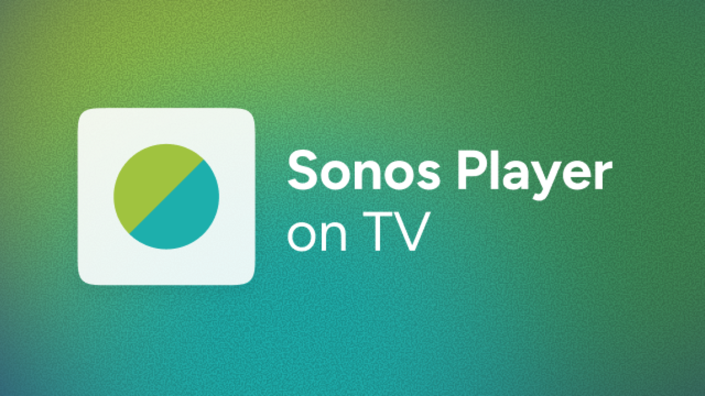

  

# Sonos Player on Android TV

  
  
  
  
  
  
  

A full-screen now-playing screen for **Android TV** and **Google TV**. Album art, track info, and playback controls on the television while your Sonos speakers play.

The app discovers speakers on your home Wi-Fi. No Sonos account required. This is not an official Sonos app.

**Version 0.13**

## Features

- Large artwork, song title, artist, album, and which room is playing
- Play, pause, skip, and volume from the TV remote (volume changes the **speakers**, not the TV)
- Queue list and room picker
- Controls fade after a few seconds of inactivity so the artwork stays visible
- Optional **screensaver** with the same now-playing screen while music is playing
- Media session for other TV apps (for example a custom home screen) to read what is playing
- **Home-screen now-playing card** on Android TV and Google TV with **Stop** and **Open** — **Open** returns to the full-screen app

## Requirements

- **Android TV or Google TV** — Chromecast with Google TV, Sony / TCL / Hisense sets, NVIDIA Shield, and similar. Not for phones.
- **Same Wi-Fi** as your Sonos speakers. Guest networks and device isolation usually block discovery.
- **Android 14 (API 34) or later** for the home-screen now-playing card. Older TV builds may not show it.

This project is not affiliated with Sonos, Inc.

**Privacy:** No account, no cloud, no analytics. The app only talks to your Sonos speakers on your local network. Settings are stored on the TV.

## Installation

Download and install instructions are in **[releases/README.md](releases/README.md)**.

## Usage

### On-screen controls

The **list** button opens the queue. The **speaker** button opens room selection. **Settings** is at the bottom of the rooms list — UI scale, artwork corners, background style, default speaker, and whether the home-screen now-playing card stays active after you press Home.

### Home-screen now playing

While music is playing and you press **Home**, Android TV and Google TV show a now-playing card on the launcher. **Stop** pauses playback on your Sonos speakers. **Open** returns to the full now-playing screen when the system allows it (most reliable on Android 16+).

Turn the card off in **Settings → Home-screen now playing**. With it off, the app only runs while you have it open.

### Screensaver

Set the TV screensaver to **Sonos Player**:

1. Open TV **Settings**.
2. Go to **Device preferences → Screen saver** (labels vary by brand).
3. Choose **Sonos Player**.
4. Set the idle timeout.

The screensaver stays on screen **only while music is playing**. If nothing is playing, the TV returns to its normal idle behaviour. Volume, skip, and Back still work on the remote. Back closes an open panel first, then dismisses the screensaver.

## FAQ

**Does the app keep running after I press Home?**  
Yes. A background service keeps the now-playing card updated and lets other apps see what’s playing. Music stays on your speakers—nothing is sent online. You can turn this off in **Settings → Home-screen now playing**.

**What does Stop on the home-screen card do?**  
It pauses playback on your Sonos speakers, same as pause in the Sonos app. On Android TV and Google TV the launcher sends a **pause** command for Stop (not a separate stop command), so the app handles that path explicitly.

**What does the Home-screen now playing setting do?**  
When **On** (default), a background service keeps the launcher card updated after you press Home. When **Off**, the app only runs while it is open — no home-screen card and no background service.

**Do I need a Sonos account?**  
No. The app finds speakers on your home network.

**Why must the TV and speakers be on the same Wi-Fi?**  
Sonos control uses local network discovery. Guest networks and device isolation usually block it.

**Does volume on the remote change the TV or the speakers?**  
The speakers, when this app or the screensaver is on screen. Some remotes only adjust TV volume on the home screen.

**Is anything collected or sent to the cloud?**  
No. No account, no analytics, no cloud. Settings stay on the TV.

## Troubleshooting

**“Looking for your Sonos…” never finishes**  
The TV and speakers must be on the same home network. A phone hotspot only works if both devices join it.

**Screensaver never appears**  
Confirm it is selected in the TV screensaver settings and that something is playing on Sonos.

**Volume changes the TV, not the speakers**  
Use the volume keys while this app or the screensaver is on screen. Some remotes only send volume to the TV from the home screen.

**Install is blocked**  
Allow installs from the file manager or LocalSend when Android prompts. Normal for apps outside the Play Store. See [releases/README.md](releases/README.md).

**“Open” on the home-screen card does nothing**  
Start playback, open the app once, then press **Home**. **Open** depends on Android version — most reliable on **Android 16+**. On Android 14–15 the system may block background launches.

**The home-screen card reappeared right after Stop**  
Fixed in **0.13** — Stop should pause the speakers and keep the card dismissed. If it still pops back, turn off **Home-screen now playing** in Settings.

**Stop works but Open does not**  
Both buttons use the same media session. **Stop** pauses playback without opening a window; **Open** must launch the app. Android 16+ allows that from the card; older TV builds may block it.

## About

Designer and front-end developer by trade. Built with AI-assisted coding tools.

## License

Source code is [MIT licensed](LICENSE). The Figtree font is under the [SIL Open Font License](LICENSE-Figtree.txt).

Found a bug or have an idea? [Open an issue](https://github.com/lexnels/Sonos-Player-on-Android-TV/issues).